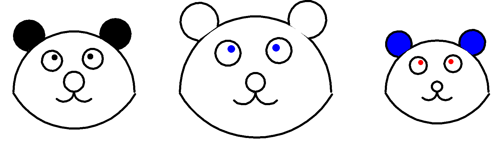
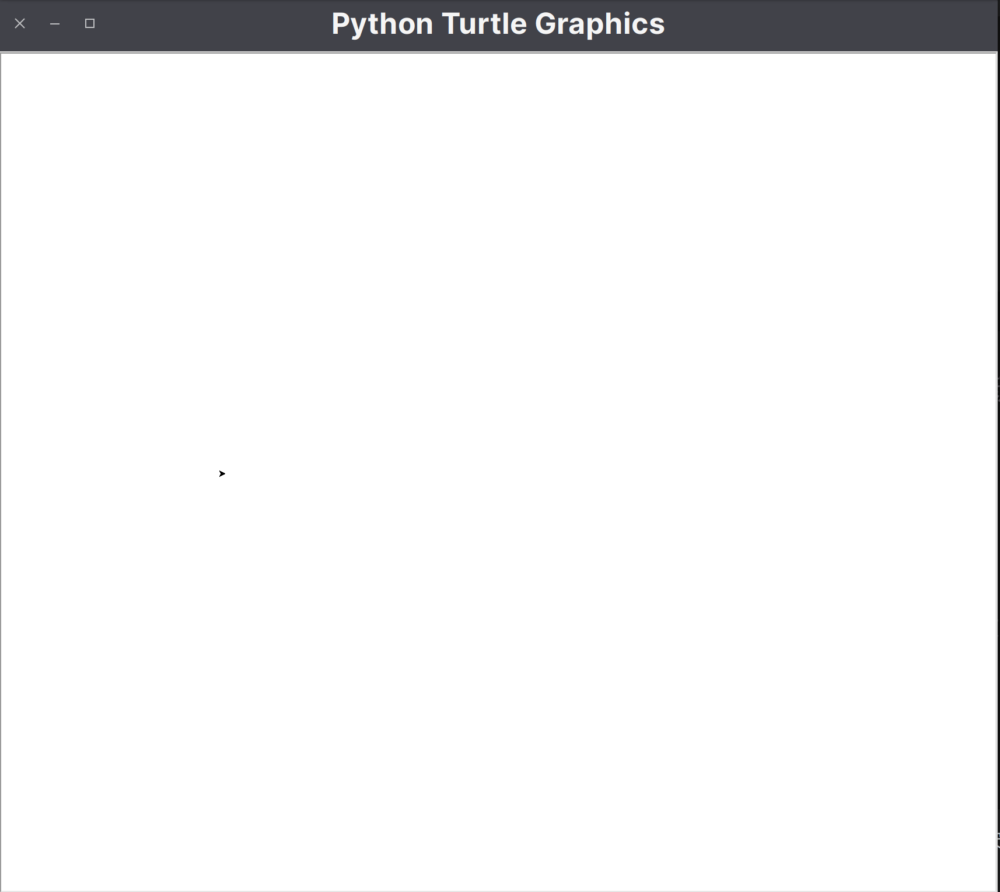
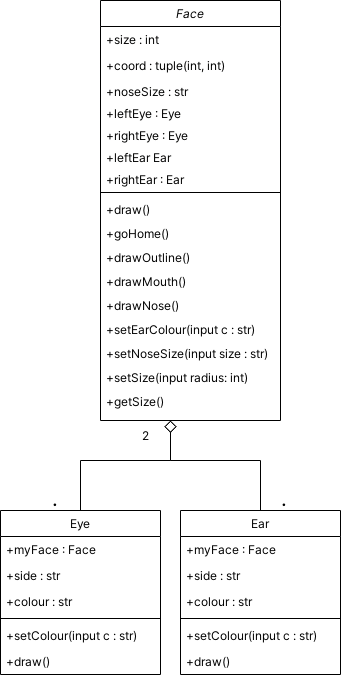
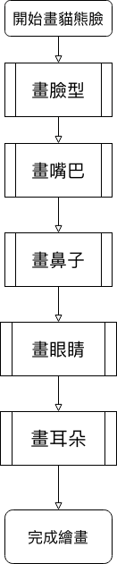
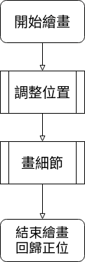
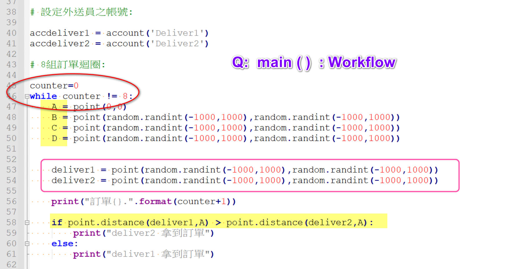
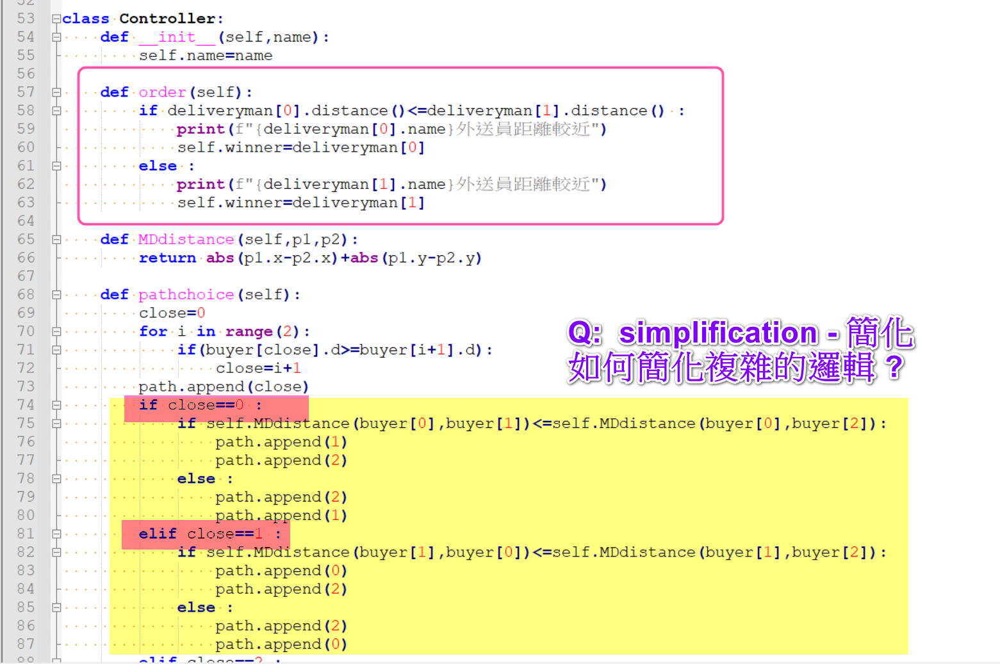
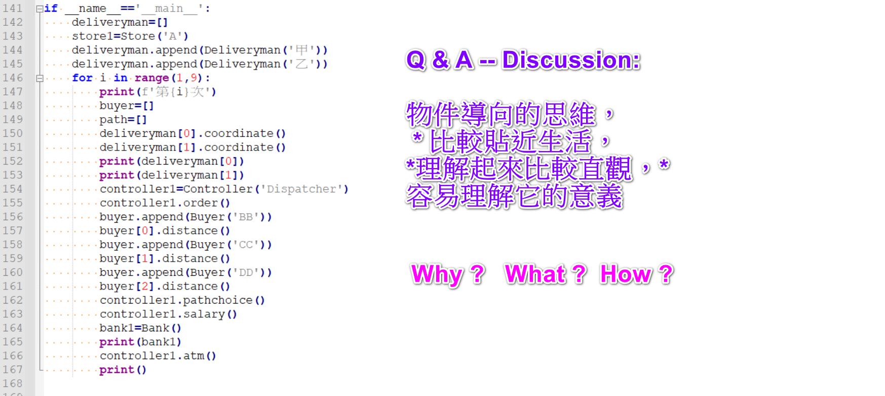

# MEG304 基於Python的資訊素養入門 PROJECT

> | Class       | Name  | ID                 |
> | ---             | ----       | ---                 |
> | 四資管四 | 王浚科 | B10709028 |
>
> > Date : 2022-01-11

## Q1 畫貓熊臉
### Output
| 繪圖輸出              | 繪圖過程        |
| :----:               | :----:        | 
|  |  |

Class Diagram - 以 Face 作為主體，組合 Eye 類別和 Ear 類別



| 整體繪圖函式呼叫過程    |部件函式呼叫過程  |
| :----:               | :----:        | 
|  |  |

### Code
> 作為主體的 Face 類別，與 Eye, Ear 兩個部件類別
> [繪圖](Code/drawing.py)
> [Face Class](Code/Face.py)
> [Eye Class](Code/Eye.py)
> [Ear Class](Code/Ear.py)
```python
from turtle import *
from Face import Face
# sets the animation speed: can be 'slow'
speed("slow")
# uncomment for instanteneous drawing - no animation
tracer(0)

panda1 = Face(-600, 0, "black") #第三個參數為設定眼睛顏色
panda1.setSize(200) # 設定臉大小
panda1.setEarColour("black") # 設定耳朵顏色
panda1.setNoseSize("large") # 設定鼻子大小
panda1.draw()

panda2 = Face(0, 0, "blue") # 耳朵顏色預設白色，鼻子大小預設正常
panda2.setSize(250)
panda2.draw()

panda3 = Face(600, 0, "red")
panda3.setSize(170)
panda3.setEarColour("blue")
panda3.setNoseSize("small")
panda3.draw()

showturtle()
done()
```

### 物件導向心得

#### 使用擁有物件導向範式的程式語言

能簡化需要重新建立物件系統的勞務工作。

#### 採納設計模式

設計模式提供的是常見問題的解法，不一定需要一五一十的尊崇。

#### 具有物件導向的思維模型

有物件導向正確觀念，才能運用自如解決問題。

#### 不要把所有的雞蛋全都放在一個籃子裡

一個類別不需要集中所有的功能，牽一髮而動全身，只會越修改越糟。

#### 把事情切割成可以用最簡單的方式解決的問題

任何複雜的問題可以看成簡單問題的組合，進而使用已知的方法解決問題。

#### 不要讓使用者知道非必要的資訊

使用者只需要必要的資訊就可以使用，不需要管內部實做細節。

## Q2 HW3 Review 
### Fig
#### Q1


#### A1

最後仍然需用 Main Function 標記程式進入點為最佳實踐，且 B, C, D, deliver1, deliver2 的屬性賦值有更好的方式，如 for loop 或 List Comprehension，也可以用下列函式替換。
```python
def getRand():
    return random.randint(-1000, 1000)
def setCoord(): 
    return point(getRand(), getRand())
```

#### Q2


#### A2

第一個步驟可以用 min 函式直接找出屬性最小值，並找出對應物件。
```python
self.winner = min(deliveryman, key=lambda d: d.distance)
```
第二步則是直接列舉情況，可以藉由最短路徑法減少重複選擇情形。

#### Q3


#### A3

對於現實的問題，物件導向的方式提供更為工程化的方式，將許多重複或是不良因素切割或重組，並且確立物件之間的關係，盡量將互相依賴的情形減少，然而這個程式並未達成物件導向的要求，過於冗長。